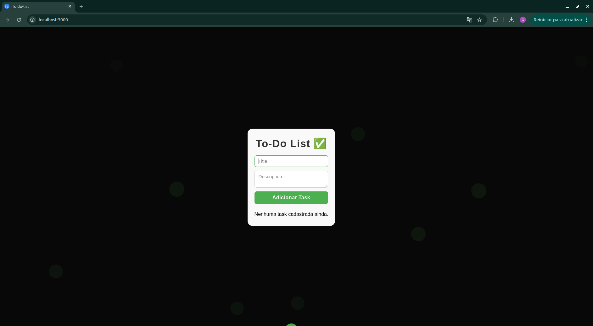
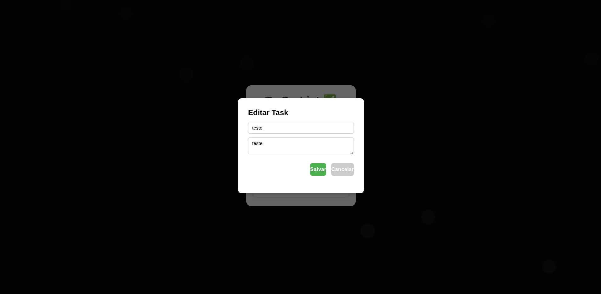
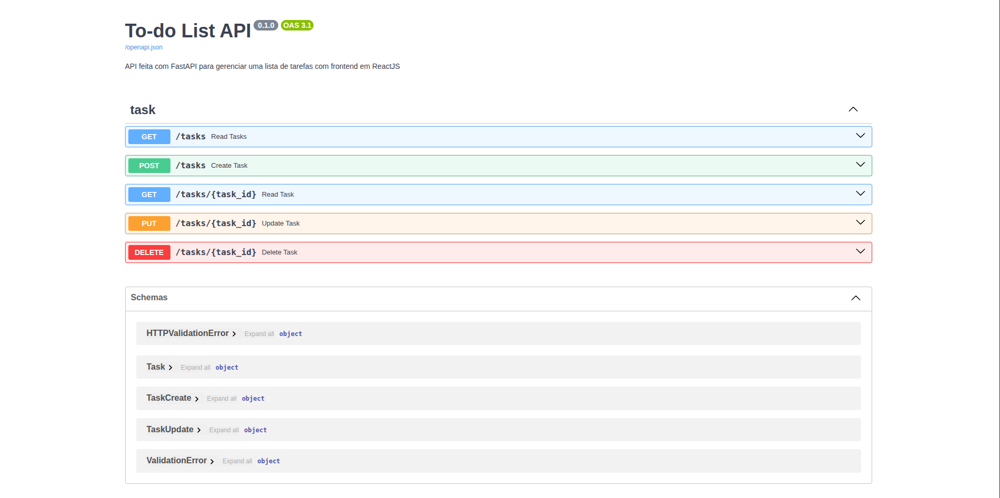

# 📝 To-Do List App


Projeto **To-Do List** com frontend em React, backend em FastAPI e banco PostgreSQL, rodando via Docker e Docker Compose.

---

## 📂 Estrutura do projeto

```
todo-app/
│
├── backend/                
│   ├── app/
│   │   ├── main.py
│   │   ├── models.py
│   │   ├── routes.py
│   │   └── ...
│   ├── requirements.txt
│   └── Dockerfile
│
├── frontend/               
│   ├── src/
│   │   ├── components/    
│   │   │   ├── TaskForm.jsx
│   │   │   ├── TaskItem.jsx
│   │   │   ├── TaskList.jsx
│   │   │   └── EditModal.jsx
│   │   ├── hooks/         
│   │   │   └── useTask.js
│   │   ├── services/      
│   │   │   └── taskService.js
│   │   ├── App.jsx
│   │   └── App.css
│   ├── package.json
│   └── Dockerfile
│
├── docker-compose.yml
└── README.md
```

---

## 🐳 Requisitos

* Docker
* Docker Compose
* Node.js (opcional para rodar frontend local)

---

## 🚀 Rodando o projeto

1. Clone o repositório:

```bash
git clone <https://github.com/gMoraes1/to-do-list-completed.git>
cd todo-app
```

2. Build e start dos containers:

```bash
docker-compose up --build
```

3. Acesse:

* Frontend: `http://localhost:5173`
* Backend FastAPI: `http://localhost:8000`
* Swagger API: `http://localhost:8000/docs`
* PostgreSQL: `localhost:5432`

> Para rodar em background: `docker-compose up -d --build`

---

## 🔄 Desenvolvimento com hot reload

### Backend

* Volume mapeado permite alterações de código sem rebuild.
* Alterações em dependências ainda exigem rebuild.


* Volume mapeado permite alterações refletidas automaticamente.
* Alterações em dependências exigem rebuild do container.

---

### Imagens





---

## ⚡ Comandos úteis

```bash
# Parar todos os containers
docker-compose down

# Logs do backend
docker-compose logs -f backend

# Entrar no container do backend
docker exec -it todo-backend bash

# Entrar no container do frontend
docker exec -it todo-frontend bash
```

---

## 🛠 Tecnologias

* Frontend: React, CSS, Hooks
* Backend: Python, FastAPI, SQLAlchemy
* Banco: PostgreSQL
* DevOps: Docker, Docker Compose

---

## 📈 Funcionalidades

* Adicionar, editar e deletar tarefas
* Marcar tarefas como completas/incompletas
* Modal de edição
* Persistência via PostgreSQL

---

